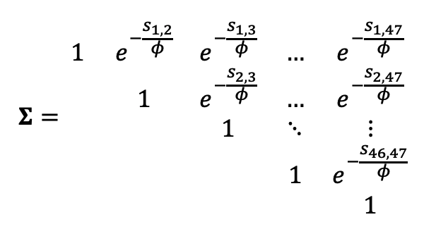

```{r, echo = F, message=F, warning=F}
library(tidyverse)
library(MASS)
library(nlme)
library(sp)
library(gstat)
library(ggtext)
library(patchwork)
library(sdmTMB)
library(magrittr)
library(ggeffects)
library(glmmTMB)
knitr::opts_chunk$set(echo = F, warning = F, message = F, fig.align = 'center')
```

## Spatial modeling with sdmTMB

1. Variance and covariance

2. Dealing with spatially correlated errors in regression models

3. Considering space explicitly with spatial random effects

4. A worked example with synoptic data and `sdmTMB`

---

```{r}
oysters <- round(rnorm(n = 30, mean = 60, sd = 10), 2)
```

### What does it mean to be "drawn from a Normal distribution"?

We sample oyster densities from 30 0.5m<sup>2</sup> quadrats along a reef.

Observed densities are

```{r, fig.height = 3.5, fig.width=8}
tibble(oysters) %>% 
  ggplot() +
  geom_hline(aes(yintercept = 0)) +
  geom_point(aes(x = oysters, y = 0), size = 5, alpha = 0.5) +
    labs(x = NULL,
         y = NULL) +
  labs(x = "Oyster density m<sup>-2</sup>",y="") +
    theme(axis.ticks.y = element_blank(),
          axis.text.y = element_blank(),
          axis.text.x = element_text(size = 14),
          axis.title.x = element_markdown(size = 16))
```

---

### What does it mean to be "drawn from a Normal distribution"?

We can characterize the distribution of observations using a model -> the **normal or Gaussian** distribution

$$\text{oyster density} \sim N(\mu, \sigma^2)$$
All we need are estimates of a **mean** $\mu$ and a **variance** $\sigma^2$ to build the model

--

```{r, fig.height = 4, fig.width=7}
df1d <- tibble(oysters)
  
ggplot(df1d) +
    geom_point(aes(x = oysters, y = 0), 
               size = 5, alpha = 0.5) +
  geom_point(aes(x = 60, y = 0), 
             size = 5, color = "darkorange") +
  labs(x = "Oyster density m<sup>-2</sup>",
       y = "Probability density") +
stat_function(fun = dnorm, 
              args = list(mean = mean(df1d$oysters), 
                          sd = sd(df1d$oysters)),
              color = "darkorange") +
  theme(axis.title = element_text(size = 16),
        axis.title.x = element_markdown(size = 16))
```

"drawn from" = "comes from" = $\sim$

???
We would expect future random samples of oysters from this age population to be distributed according to this model

---
### Extending the Gaussian to multiple dimensions

The relationship between **two** normally distributed variables is described by the **multivariate normal** distribution. 


```{r, fig.height=4, fig.width=8}
df1 <- mvrnorm(300, mu = c(0,0), Sigma = diag(2)) %>% 
  as_tibble() 

S <- diag(2)
S[1,2] <- 0.9
S[2,1] <- 0.9
df2 <- mvrnorm(300, mu = c(0,0), Sigma = S) %>% 
  as_tibble()

p1 <- ggplot(df1) +
  geom_point(aes(x = V1, y = V2)) +
  # geom_point(aes(x = mean(V1), y = mean(V2)), color = "darkorange")+
  geom_point(aes(x = 0, y = 0), 
             color = "darkorange") +
  stat_ellipse(aes(x = V1, y = V2), 
               color = "darkorange") +
  labs(y = "V2",
       x = "V1")

p2 <- ggplot(df2) +
  geom_point(aes(x = V1, y = V2)) +
  # geom_point(aes(x = mean(V1), y = mean(V2)), 
  #            color = "darkorange")+
  geom_point(aes(x = 0, y = 0), 
             color = "darkorange") +
  stat_ellipse(aes(x = V1, y = V2), 
               color = "darkorange")+
  labs(y = "V2",
       x = "V1")

p1 + p2
```

```{r, out.width = "60%"}
knitr::include_graphics("images/mvnorm.png")
```

---
### Extending the Gaussian to multiple dimensions

The relationship between **two** normally distributed variables is described by the **multivariate normal** distribution. 

```{r, fig.height=4, fig.width=8}
p1 + p2
```

```{r, out.width = "60%"}
knitr::include_graphics("images/mvnorm2.png")
```

---
### Oyster densities in space

After our first sample, we move to a different barrier island and repeat the sampling. We then return to the original site and sample a reef 10 m away from the first site. 

**How would you expect our original sample to covary with the new data?**

--

```{r, fig.height=4, fig.width=8}
df1 <- mvrnorm(30, mu = c(60,60), Sigma = diag(2)) %>% 
  as_tibble() 

S <- diag(2)
S[1,2] <- 0.9
S[2,1] <- 0.9
df2 <- mvrnorm(30, mu = c(60,60), Sigma = S) %>% 
  as_tibble()

p1 <- ggplot(df1) +
  geom_point(aes(x = V1, y = V2)) +
  geom_point(aes(x = mean(V1), y = mean(V2)), color = "darkorange")+
  stat_ellipse(aes(x = V1, y = V2), 
               color = "darkorange") +
  labs(y = "Oyster density (diff. barrier island)",
       x = "Oyster density at original site")  +
  theme(axis.title = element_text(size = 16))

p2 <- ggplot(df2) +
  geom_point(aes(x = V1, y = V2)) +
  geom_point(aes(x = mean(V1), y = mean(V2)),
             color = "darkorange")+
  stat_ellipse(aes(x = V1, y = V2), 
               color = "darkorange")+
  labs(y = "Oyster density (nearby original site)",
       x = "Oyster density at original site") +
  theme(axis.title = element_text(size = 16))

p1 + p2
```

Oyster densities at nearby sites covary according to some unmeasured process (predation? exposure?)

---

### Spatial autocorrelation 

**Tobler's first law of geography:** "Everything is related to everything else, but near things are more related than distant things."

--

* In regression, we want covariates to explain dependency structures in relationships (environmental gradient explain oyster densities)

--

* Oftentimes, what's left over from regression (residual errors) aren't randomly distributed as expected, but **covary according to some unmeasured spatial process**

--

* **Spatially autocorrelated** regression residuals violate the assumption of residual independence 

* **A form of pseudoreplication** 

--

## How do we typically deal with spatially autocorrelated error?

---

### Generalized least squares

* One way is with **GLS**

* GLS methods use a similar approach to deal with spatial and temporal autocorrelation in residuals

--

Here's a regression model to consider

$$\text{seagrass density}_i = \beta_0 + \text{elevation}_i\beta_1 + \varepsilon_i,$$
```{r, echo = F, fig.align='center', fig.width=10, fig.height = 5, out.width="80%", message=F, warning=F}
library(tidyverse)
library(sf)
load(here::here("data/bound_sg.rdata"))

sg_df <- sg_bound %>% 
  mutate(meadow = ifelse(str_detect(SiteName, "HI"), "HI", "SB")) %>% 
  dplyr::select(shoots = shoots_raw, 
                elevation = depth, meadow,
                longitude, latitude,
                year, SiteName) %>% 
  st_set_geometry(NULL) %>% 
  filter(shoots > 0, year == 2018, meadow == "HI")

mod <- gls(shoots ~ elevation, data = sg_df)

sg_df$res <- resid(mod, type = "n")

fig <- ggplot(sg_df) +
  geom_point(aes(x = elevation, y = shoots)) +
  theme_bw() +
  labs(y = "Shoots m^-2", x = "Elevation (m)") +
  theme(axis.title = element_text(size = 16)) +
  geom_smooth(aes(x = elevation, y = shoots), method = "lm")

res1 <- ggplot(sg_df) +
  geom_point(aes(x = elevation, y = res)) +
  geom_hline(yintercept = 0) +
  labs(y = "Normalized residuals", x = "Elevation (m)",
       title = "LM residuals") +
    theme_bw() +
theme(axis.title = element_text(size = 16)) 

fig + res1 + plot_layout(nrow = 1)
```
---

### Generalized least squares

Question: is there spatial autocorrelation in model residuals?

Option 1: Make a visual assessment of residual spatial autocorrelation

```{r, echo = F, warning = F, message=F, fig.width=7, fig.height=5}
ggplot(sg_df) +
  geom_point(aes(x = longitude, y= latitude, 
                 size = res, color = res)) +
  labs(size = "Standardized\n residuals",
       color = "Standardized\n residuals") +
   scale_color_continuous(limits=c(-2.5, 3), breaks=seq(-2, 3, by=1)) +
   scale_size_continuous(limits=c(-2.5, 3), breaks=seq(-2, 3, by=1)) +
   guides(color= guide_legend(), size=guide_legend()) +
    theme_bw() +
theme(axis.title = element_text(size = 16)) 
```

---
### Generalized least squares

Question: is there spatial autocorrelation in model residuals?

Option 2: Assess residual autocorrelation with **sample variogram**

```{r, fig.width=5, fig.height=4}
sg_df2 <- sg_df
coordinates(sg_df2) <- c("longitude","latitude")
vario <- variogram(res ~ 1, sg_df2)
plot(vario)
```

--

**Semivariance:** a measure of the dependence between two observations as a function of distance

* High semivariance -> low dependence
---
### Generalized least squares

We think residual spatial autocorrelation is a problem, so we'll fit a GLS model.

--

To see how this works, first reinterpret the original model in matrix notation:

$$\text{seagrass density}_i = \pmb{X_i}\beta + \varepsilon_i,$$

--

$\text{seagrass density}_i$ = vector of *seagrass density<sub>1</sub>, ..., seagrass density<sub>45</sub>* observations  
  
--
  
$\pmb{X_i}$ = a two-column matrix with the first column equal to 1 and the second containing all observations of covariate **elevation**

--

$\beta$ = vector containing parameter estimates ( $\beta_0$ and $\beta_1$)

--

$\varepsilon_i$ = a vector of model residuals

---

### Generalized least squares

The statement $\varepsilon \sim N(0, \sigma^2)$ can be reinterpreted in terms of covariance as 

$$\pmb{\varepsilon} \sim N(0, \sigma^2\pmb{I}),$$
where $\pmb{I}$ is a *n x n* identity matrix and $\pmb{\Sigma} = \sigma^2\pmb{I}$

* Identity matrix - a matrix where the diagonal elements are 1 and off-diagonal elements are 0

--
```{r, echo = F}
I <- diag(6)
I[1:6, 1:6]
```


(First 6 rows and columns)
---
### Generalized least squares

The statement $\varepsilon \sim N(0, \sigma^2)$ can be reinterpreted in terms of covariance as 

$$\pmb{\varepsilon} \sim N(0, \sigma^2\pmb{I}),$$
where $\pmb{I}$ is a *n x n* identity matrix and $\pmb{\Sigma} = \sigma^2\pmb{I}$


In the model, we estimated the residual variance term to be 110.302, so the residual covariance matrix is $\sigma^2 I$ or

```{r, echo = F}
sigma <- summary(mod)$sigma
I <- diag(length(sg_df$shoots))
sigma * I[1:6, 1:6] 
```

(First 6 rows and columns)

---

### Generalized least squares

* The off-diagonal zero terms represent our assumption of independence. 

--

* We've established that we are violating this assumption, so we need a new **correlation function** to calculate the off-diagonal elements of the covariance matrix.

--

The exponential correlation function is:

$$h(s, \phi) = \text{exp}(-\frac{s}{\phi}),$$
where $\phi$ is called the **range** and $s$ is the distance between two points.

```{r}
knitr::include_graphics("images/variogram_functions.png")
```

---

### Generalized least squares

Plugging in the values for the off-diagonal elements gives us a new residual covariance matrix $\pmb{\Sigma}$ (shown here as a correlation matrix):

```{r, out.width="50%"}

```

This matters because we use the new $\pmb{\Sigma}$ to estimate model parameters ( $\hat{\beta}$, standard errors)

$$\hat{\beta} = (\pmb{X}^T \times \pmb{\Sigma}^{-1}\times \pmb{X})^{-1} \times \pmb{X}^T \times \pmb{\Sigma}^{-1} \times y $$
---

### Generalized least squares

Fit the model and check for residual spatial autocorrelation

```{r, echo = T}
mod2 <- gls(shoots ~ elevation, data = sg_df, method = "REML",
           correlation = corExp(form = ~longitude+latitude))
sg_df$res <- resid(mod2, type = "n")
```

```{r, fig.height=4, fig.width=8}
res2 <- ggplot(sg_df) +
  geom_point(aes(x = elevation, y = res)) +
  geom_hline(yintercept = 0) +
  labs(y = "Normalized residuals", x = "Elevation (m)",
       title = "GLS resid. w/ exp. corr. struct.") +
    theme_bw() +
theme(axis.title = element_text(size = 16)) 

res1 + res2
```


---

### Another solution: Spatial random effects

* GLS imposes a correlation structure on the residual covariance matrix $\pmb{\Sigma}$, but it's often not enough to account for residual autocorrelation

--

The **spatial random effects** model:

$$\text{seagrass density}_i = \pmb{X_i}\beta + u_i + \varepsilon_i$$
$$\pmb{\varepsilon} \sim N(0, \sigma^2\pmb{I})$$
$$\pmb{u} \sim N(0, \pmb{\Omega})$$
where $\varepsilon_i$ are random errors and $u_i$ are the spatial random effects with mean 0 and covariance $\pmb{\Omega}$.

--

* Spatial random effects = random intercepts with imposed correlation structure (think GLS correlation structures)

* Spatial random effects are **latent** variables. 

* Represent unmeasured things affecting your data ("habitat quality")

<!-- Imagine we collect fish with seine nets in ten locations -->

<!-- ```{r, echo = F, fig.align='center', fig.width=10, fig.height = 5, out.width="80%", message=F, warning=F} -->
<!-- Nsite <- 10 -->
<!-- Nobs_per_site <- 10 -->
<!-- Site_logMean <- log(10) #this occur in log space -->
<!-- Site_logSd <- 1 #this occurs in log space -->

<!-- # Bookkeeping - indicator for observations belonging to each site -->
<!-- s_i <- rep( 1:Nsite, each=Nobs_per_site) -->

<!-- # Simulation -->

<!-- z_s <- rnorm( Nsite, mean=0, sd=Site_logSd ) #what's the value of the random effect for each of the 10 sites? -->
<!-- Mean_s <- exp( Site_logMean + z_s ) #Simulate mean counts of each site by exponentiating (how many rabbits) -->
<!-- y_i <- rpois( Nsite*Nobs_per_site, lambda=Mean_s[s_i] ) # the data -->

<!-- df <- tibble(cpue = y_i, -->
<!--        site = factor(rep(1:10, each = 10)), -->
<!--        x = rep(rnorm(10), each = 10), -->
<!--        y = rep(rnorm(10), each = 10)) -->

<!-- catch <-  -->
<!--   ggplot(df) + -->
<!--   geom_boxplot(aes(x = site, y = cpue)) + -->
<!--   labs(y = "CPUE", -->
<!--        title = "CPUE at each location") + -->
<!--   theme(title = element_text(size = 16), -->
<!--         axis.title = element_text(size = 16)) -->

<!-- map <-  -->
<!--   ggplot(df) + -->
<!--   geom_point(aes(x = x, y = y)) + -->
<!--   labs(title = "Site locations") + -->
<!--   theme(title = element_text(size = 16), -->
<!--         axis.title = element_text(size = 16)) -->

<!-- map + catch + plot_layout(nrow = 1) -->
<!-- ``` -->

<!-- We want to account for unmeasured variability across sites, so we assign random intercepts for each site. -->

<!-- $$c_i \sim \text{Poisson}(\lambda_i)$$ -->
<!-- $$\pmb{\lambda_i} = \text{exp}(\pmb{X_i}\pmb{\beta} + \pmb{z_ib})$$ -->
<!-- $$\pmb{b} \sim Normal(0, \sigma_{b}^2)$$ -->
<!-- --- -->

<!-- ### Random intercept model -->

<!-- ```{r} -->
<!-- library(lme4) -->
<!-- mod <- glmer(cpue ~ 1 + (1|site), family = "poisson", data = df) -->
<!-- df$pred <- predict(mod, type = "response") -->
<!-- df$int <- exp(fixed.effects(mod)) -->
<!-- ``` -->

<!-- ```{r, fig.width=8, fig.height=5} -->
<!-- ggplot(df) + -->
<!--   geom_hline(aes(yintercept = int), color = "purple") + -->
<!--   geom_violin(aes(x = site, y = cpue)) + -->
<!--   geom_point(aes(x = site, y = pred), color = "blue") + -->
<!--   labs(title = "Observations, random intercepts (blue), and fixed intercept (purple)", -->
<!--        y = "CPUE") + -->
<!--     theme(title = element_text(size = 13), -->
<!--         axis.title = element_text(size = 16)) -->
<!-- ``` -->


